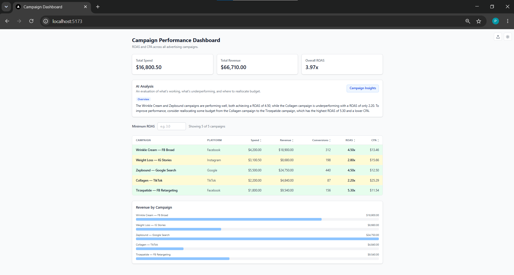

## Campaign Performance Dashboard

A full stack dashboard that reads advertising campaign data from a CSV and shows key metrics like ROAS and CPA. You can sort and filter the table, see rows color coded by performance, get an AI written summary of the data, switch between light and dark mode, and upload your own CSV to view different data.



## Tech Stack

- **Backend:** Node.js, Express, TypeScript
- **Frontend:** React, TypeScript, Vite, Tailwind CSS
- **Data:** CSV, parsed with `csv-parser` and cached in memory
- **AI insights:** OpenAI API

## Features

- Table of every campaign with calculated ROAS and CPA
- Rows color coded by ROAS (green at 3.0 and above, yellow from 1.5 to 2.99, red below 1.5)
- Summary bar showing total spend, total revenue, and overall ROAS
- Filter by minimum ROAS, and sort by any numeric column
- Revenue by campaign bar chart
- AI written insights that stream in and cycle through different takes on the data
- Light and dark mode toggle
- Upload your own CSV to replace the data, with a button to reset back to the sample

## Project Structure

```
technical_assessment/
├── backend/              # Express + TypeScript API
│   ├── data/             # campaigns.csv (sample data)
│   └── src/
│       ├── config/       # environment loading
│       ├── services/     # CSV parsing, metrics, OpenAI insights
│       └── types/        # shared types
└── frontend/
    └── src/
        ├── components/   # dashboard UI
        ├── lib/          # API calls and formatting
        ├── theme/        # light and dark provider and toggle
        ├── styles/       # color tokens
        └── types/        # shared types
```

## Prerequisites

- Node.js 20.19+ or 22.12+ (developed on v22.14.0)
- npm

## Running Locally

The app has two parts that run separately, so use two terminals.

### Backend (API)

```bash
cd backend
npm install
npm run dev
```

Runs on http://localhost:3000.

For a production build:

```bash
npm run build
npm start
```

### Frontend (UI)

```bash
cd frontend
npm install
npm run dev
```

Runs on http://localhost:5173. In development, Vite proxies `/api` requests to the backend on port 3000, so there is no CORS setup to worry about.

## Environment Variables

The Campaign Insights feature calls the OpenAI API. Copy `backend/.env.example` to `backend/.env` and add your key:

```
OPENAI_API_KEY=your_key_here
OPENAI_MODEL=gpt-4o-mini   # optional, defaults to gpt-4o-mini
```

`.env` is gitignored and never committed, and `.env.example` documents the variables. The backend also reads an optional `PORT` (defaults to 3000) and an optional `CAMPAIGNS_CSV` path if you want to load a different sample file.

## API Endpoints

- `GET /api/health` returns a simple status check.
- `GET /api/campaigns` returns every campaign with its calculated ROAS and CPA.
- `GET /api/summary` returns total spend, total revenue, and overall ROAS.
- `POST /api/insights?angle=N` streams a short AI written summary of the current data as plain text. The angle chooses which take you get (0 for an overview, 1 for what to cut, 2 for where to scale) and wraps around so you can keep cycling. Each angle is cached so repeats come back instantly.
- `POST /api/upload` takes a CSV in the request body as text, checks that it has the required columns, and replaces the active dataset. The required columns are campaign_id, campaign_name, spend, revenue, conversions, and platform.
- `POST /api/reset` restores the original sample data.

## Assessment Notes

This repository covers Parts 1 and 2, the dashboard and the OpenAI integration. The light and dark mode and the CSV upload are extra features beyond the required scope. The corrected Part 3 bug hunt file lives in the `part3` folder. The written explanations for Part 3 (Bug Hunt) and Part 4 (System Design) are in the document submitted alongside this repo.
